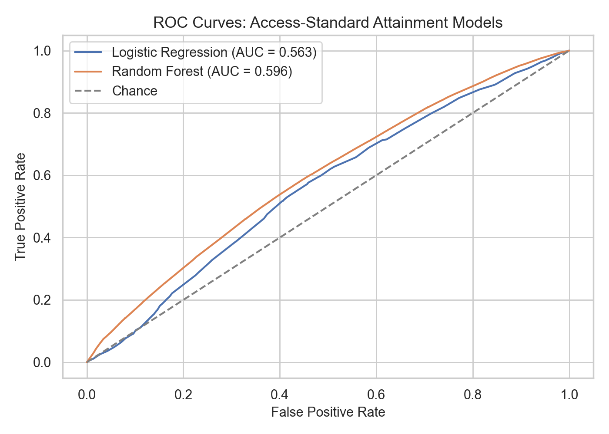
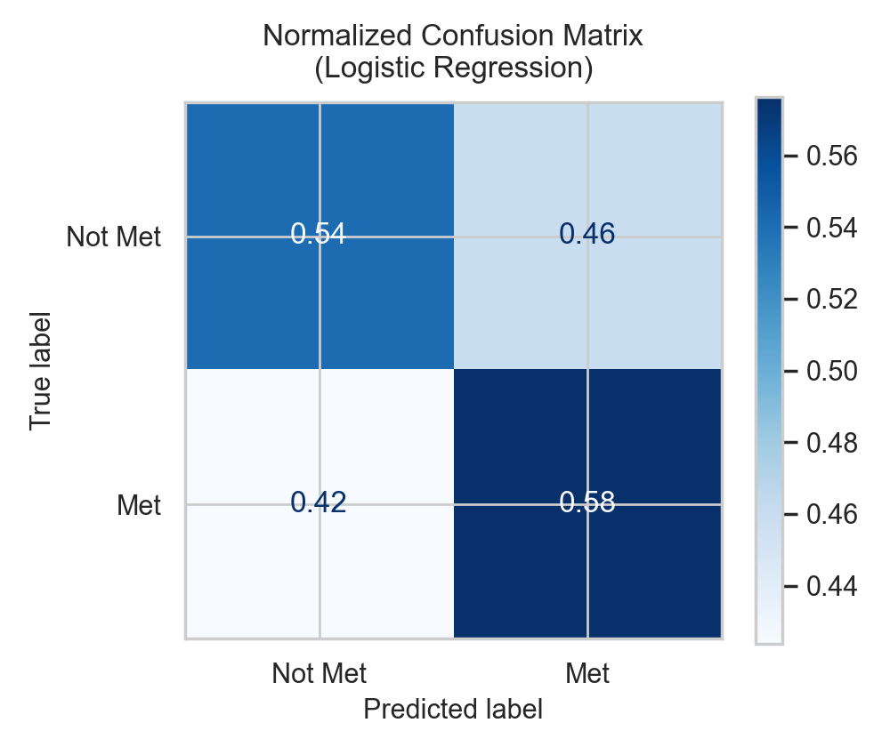

# missouri-va-access-analytics

A data-driven analysis of Veterans Affairs appointment wait times and care pathways, including VA vs. community performance metrics, filtering Missouri facilities from 2014–2025 to build an evidence-based decision-support model.

**Short tagline:**


---

## Introduction


--

## Machine Learning Model Results

<h3 align="center">Figure 1 — ROC Curves</h3>
<p align="center">
  
</p>
<p align="center">
  <em>ROC curves for logistic regression and random forest models predicting access-standard
  attainment. The random forest model achieves a higher AUC on the held-out test set, indicating
  better discriminatory performance between timely and delayed appointments.</em>
</p>

---

<h3 align="center">Figure 2 — Logistic Regression Confusion Matrix</h3>
<p align="center">
  
</p>
<p align="center">
  <em>Normalized confusion matrix for the logistic regression model. Values represent the proportion
  of true “Met” and “Not Met” appointments classified into each category.</em>
</p>

---

<h3 align="center">Figure 3 — Random Forest Confusion Matrix</h3>
<p align="center">
  
</p>
<p align="center">
  <em>Normalized confusion matrix for the random forest model. Compared to logistic regression,
  the ensemble model improves sensitivity for appointments that meet the access standard while
  maintaining similar specificity.</em>
</p>


---

## Project Structure

```text
missouri-va-access-analytics/
|   | - data/
|      | - cleaned
|          | - cleaned_mo_waits.csv.gz
|          | - cleaning_summary.csv
|      | - metadata
|          | - eda_compliance_by_setting.csv
|          | - eda_group_stats_setting_specialty.csv
|          | - eda_numeric_summary.csv
|          | - figures_manifest.csv
|          | - ml_model_metrics_summary.csv
|          | - ml_rf_feature_importances.csv
|      | - processed/  # Missouri-only data exported to Git
|          | - consult_waits_state_subset.csv.gz
|      | - raw/        # original files (ignored by Git due to file size)
|          | - consult_waits_2024_03_25.csv
|      | - figures 
|          | - eda
|              | - correlation_matrix.png
|              | - eda_access_by_setting_bar.png
|              | - eda_waitdays_box_by_setting.png
|              | - eda_waitdays_hist.png
|              | - missing_heatmap.png
|              | - missing_matrix.png
|              | - trend_median_wait_by_year_community.png
|              | - trend_median_wait_by_year_va.png
|          | - ml
|              | - ml_confusion_logistic_regression.png
|              | - ml_confusion_random_forest.png
|              | - ml_feature_importance_rf_top15.png
|              | - ml_roc_logreg_vs_rf.png
|      | - mech_diag.png
|      | - scripts/
|          | - clean_mo_waits.py
|          | - count_rows_cols.py
|          | - generate_mechanism_diagram.py
|          | - prepare_missouri_data.py
|   | - .gitgnore
|   | - LICENSE
|   | - README.md
|   | - requirements.txt
|   | - va_mo_waits.ipynb
```


---

## Requirements

- **Python:**
  

---

## Quick Start

## 1) Create, Activate, and Install Dependencies for .venv

Windows
```shell
# Navigate to the project root
cd C:\Projects\missouri-va-access-analytics

# Create a new virtual environment
python -m venv .venv

# Activate the virtual environment
.\.venv\Scripts\Activate

# Upgrade pip (recommended)
python -m pip install --upgrade pip

# Install required dependencies
pip install -r requirements.txt

# (Optional) Register .venv as a Jupyter kernel
python -m ipykernel install --user --name missouri-va-venv --display-name "Python 3.11 – MO VA (.venv)"
```

macOS/Linux
```bash
# Navigate to the project root
cd ~/Projects/missouri-va-access-analytics

# Create a new virtual environment
python3 -m venv .venv

# Activate the virtual environment
source .venv/bin/activate

# Upgrade pip (recommended)
python -m pip install --upgrade pip

# Install required dependencies
pip install -r requirements.txt

# (Optional) Register .venv as a Jupyter kernel
python -m ipykernel install --user --name missouri-va-venv --display-name "Python 3.11 – MO VA (.venv)"
```

---

### Recommended tooling


### Why the Raw Data Folder Is Ignored

The `.gitignore` file contains the following lines:

```bash
# Never commit full dataset
data/raw/
```

These entries ensure that large, original data files stored in the `data/raw/` directory are **not committed to the GitHub repository**.

This rule serves two key purposes:

1. **Repository Size and Performance**  
   The full dataset can exceed GitHub’s 100 MB per-file limit and significantly slow down cloning and version control operations.  
   By ignoring this folder, the repository remains lightweight, efficient, and easier to maintain.

2. **Reproducibility and Clean Workflow**  
   Only the **data preparation scripts** and the **processed Missouri-only dataset** are versioned in Git.  
   Anyone replicating the project can download the raw dataset separately, place it in the `data/raw/` directory, and run the included preparation script to regenerate the processed data.

In summary, this `.gitignore` rule prevents large or sensitive raw data files from being uploaded to GitHub while maintaining a clean, reproducible, and efficient project workflow.


---

## Authors

Contributors names and contact info <br>
@github.com/Data-Git-Hub <br>


---

## References


---

## Version History
- Proj 6.0  | Modify README.md
- Proj 5.2  | Modify va_mo_waits.ipynb, README.md
- Proj 5.1  | Modify va_mo_waits.ipynb, README.md
- Proj 5.0  | Modify va_mo_waits.ipynb, requirements.txt, README.md
- Proj 4.6  | Modify va_mo_waits.ipynb, README.md - Easier use for LaTex
- Proj 4.5  | Modify va_mo_waits.ipynb, README.md
- Proj 4.4  | Modify README.md
- Proj 4.3  | Add metadata folder, figures folder, eda folder;Modify README.md
- Proj 4.2  | Modify va_mo_waits.ipynb, README.md
- Proj 4.1  | Add cleaned_mo_waits.parquet; Modify clean_mo_waits.py; README.md
- Proj 4.0  | Add va_mo_waits.ipynb; Modify README.md
- Proj 3.3  | Modify README.md
- Proj 3.2  | Add cleaning_summary.csv; Modify clean_mo_waits.py; README.md
- Proj 3.1  | Delete placeholder file text.txt from cleaned folder; Modify README.md
- Proj 3.0  | Add clean_mo_waits.py; Modify README.md
- Proj 2.0  | Add cleaned folder to data folder; Modify README.md
- Proj 1.4  | Add count_rows_cols.py; Modify README.md
- Proj 1.3  | Modify prepare_missouri_data.py, README.md
- Proj 1.2  | Modify prepare_missouri_data.py, README.md
- Proj 1.1  | Modify prepare_missouri_data.py, requirements.txt, README.md
- Proj 1.0  | Add prepare_missouri_data.py; Modify README.md
- Init 0.2  | Modify requirements.txt, README.md
- Init 0.1  | Add scripts folder, prepare_missouri_data.py, consult_waits_2024_03_25.csv; Modify .gitignore, README.md
- Init 0.0  | Add data folder, process folder, raw folder, requirements.txt; Modify .gitignore, README.md

## Test History
- Test 1.0  | Test prepare_missouri_data.py: TEST-FAIL script did not process consult_waits_2024_03_25.csv
- Test 1.1  | Test prepare_missouri_data.py: TEST-FAIL script did not process consult_waits_2024_03_25.csv
- Test 1.2  | Test prepare_missouri_data.py: TEST-SUCCESS created consult_waits_state_subset.csv.gz
- Test 2.0  | Test clean_mo_waits.py: TEST-FAIL created mo_wait_clean.csv.gz with 1kb of information
- Test 2.1  | Test clean_mo_waits.py: TEST-SUCCESS created mo_wait_clean.csv.gz, cleaning_summary.csv
- Test 3.0  | Test va_mo_waits.ipynb: TEST-SUCCESS created readable .png files for LaTex

## Commit History (Commits needed to complete Sync due to Internet Connection Error or other factor)
- Comm  0.1 | Commit retire due to connection error